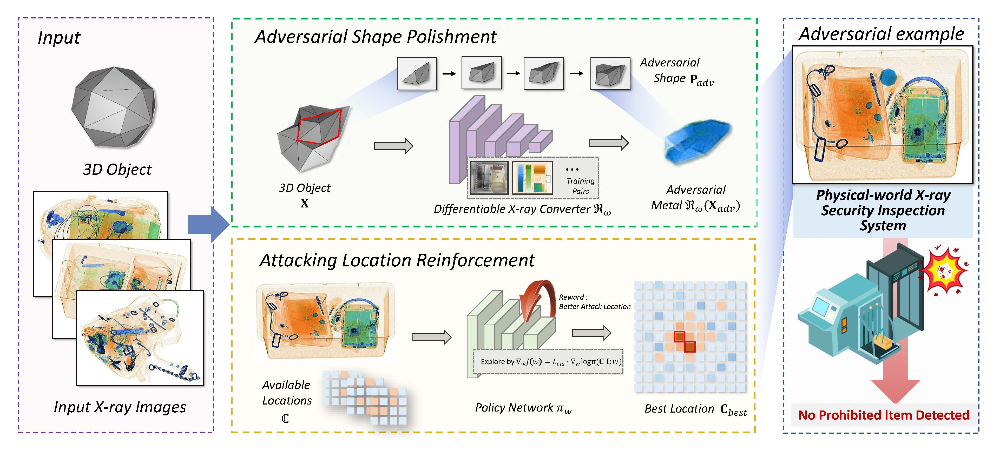

# X-Adv:  Physical Adversarial Object Attacks against X-ray Prohibited Item Detection



## Introduction

This repository is the official PyTorch implemetation of paper "X-Adv: Physical Adversarial Object Attacks against X-ray Prohibited Item Detection".

## Install

### Requirements

* Python >= 3.6

* PyTorch >= 1.8

```shell
pip install -r requirements.txt
```

### Data Preparation

#### XAD

The XAD dataset will be released after accepted.

#### OPIXray & HiXray

Please refer to [**this website**](https://github.com/DIG-Beihang/XrayDetection) to acquire download links.

#### Data Structure

The downloaded data should look like this:

```
dataset_root
|-- train
|      |-- train_annotation
|      |-- train_image
|      |-- train_knife.txt
|-- test
       |-- test_annotation
       |-- test_image
       |-- test_knife.txt
```

After acquiring the datasets, you should modify `data/config.py` to set the dataset directory.

### VOC pretrained weights

For SSD detection models, the pre-trained weight on VOC0712 can be found at [here](https://s3.amazonaws.com/amdegroot-models/ssd300_mAP_77.43_v2.pth).

For Faster R-CNN models, we apply the pre-trained weight from [this issue](https://github.com/chenyuntc/simple-faster-rcnn-pytorch/issues/63), which does not need to be converted from caffe.

## Usage

### Training

Training for SSD models (original, DOAM, LIM):

```shell
python train_ssd.py --dataset OPIXray/HiXray/XAD \
    --model_arch original/DOAM/LIM \
    --transfer ./weights/ssd300_mAP_77.43_v2.pth \
    --save_folder ./save
```

Training for Faster R-CNN:

```shell
python train_frcnn.py --dataset OPIXray/HiXray/XAD \
    --transfer ./weights/vgg16-397923af.pth \
    --save_folder ./save
```

### Attack

Attack SSD models (original, DOAM, LIM) with X-Adv:

```shell
python attack_ssd.py --dataset OPIXray/HiXray/XAD \
    --model_arch original/DOAM/LIM \
    --ckpt_path ../weights/model.pth \
    --patch_place reinforce \
    --patch_material iron \
    --save_path ./results
```

Attack Faster R-CNN with X-Adv:

```shell
python attack_ssd.py --dataset OPIXray/HiXray/XAD \
    --patch_place reinforce \
    --ckpt_path ../weights/model.pth \
    --patch_material iron \
    --save_path ./results
```

Below are some combinations of `patch_place` and `patch_material`:

| Method            | `patch_place` | `patch_material` |
| ----------------- | ------------- | ---------------- |
| meshAdv           | fix           | iron_fix         |
| AdvPatch          | fix_patch     | iron             |
| X-Adv | reinforce     | iron             |

### Evaluation

Evaluate SSD models (original, DOAM, LIM):

```shell
python test_ssd.py --dataset OPIXray/HiXray/XAD \
    --model_arch original/DOAM/LIM \
    --ckpt_path ../weights/model.pth \
    --phase path/to/your/adver_image
```

Evaluate Faster R-CNN:

```shell
python test_ssd.py --dataset OPIXray/HiXray/XAD \
    --ckpt_path ../weights/model.pth \
    --phase path/to/your/adver_image
```

## Citation

If this work helps your research, please cite the following paper.

## Reference

[Original implementation and pre-trained weight of SSD](https://github.com/amdegroot/ssd.pytorch)

[Implementation and pre-trained weight of Faster R-CNN](https://github.com/chenyuntc/simple-faster-rcnn-pytorch)

[Official repository of DOAM and OPIXray](https://github.com/DIG-Beihang/OPIXray)

[Official repository of LIM and HiXray](https://github.com/HiXray-author/HiXray)